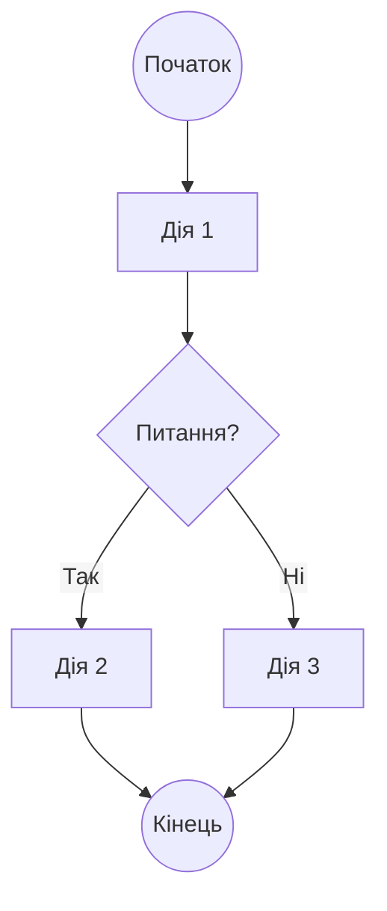
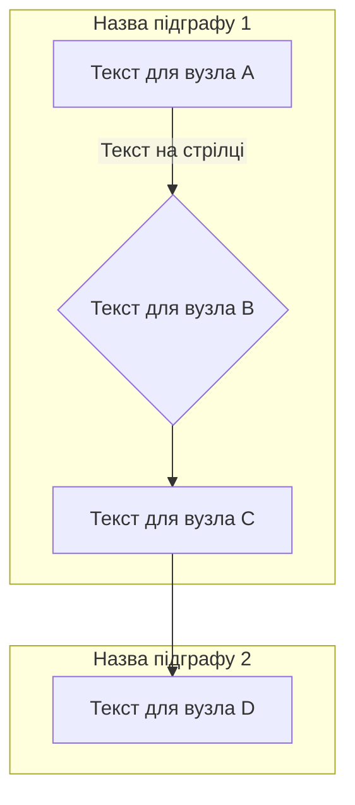
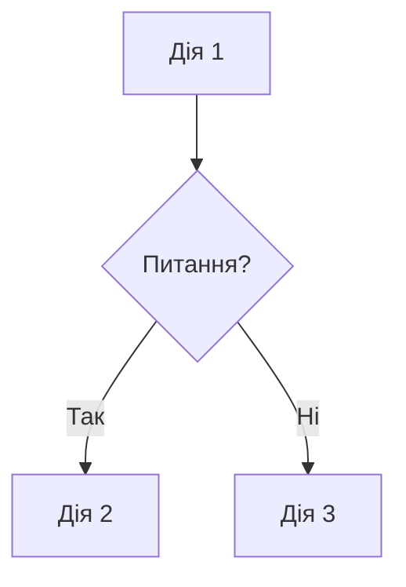

# Правило: Інструмент для створення Mermaid-діаграм v2 (mermaid_tool_2)

## 1. Мета

Це правило надає набір строгих синтаксичних стандартів та готовий шаблон для створення Mermaid-діаграм, які гарантовано коректно відображатимуться у нашому середовищі. Його мета — уникнути поширених помилок парсингу, таких як `Unsupported markdown: list`. Версія 2 інтегрує найкращі практики з офіційної документації Mermaid та досвіду спільноти.

## 2. Коли використовувати

Використовуйте це правило щоразу, коли створюєте або редагуєте Mermaid-діаграми (`flowchart` або `graph`) у будь-якому `.md` файлі.

## 3. Ключові принципи ("Золоті правила")

Наш парсер Markdown дуже чутливий. Щоб уникнути конфліктів, дотримуйтесь цих правил:

1. **Жодних відступів**: Усі рядки всередині блоку ```mermaid ... ``` повинні починатися з першого символу рядка. Не використовуйте `Tab` або пробіли для форматування коду діаграми.

2. **Усі мітки в лапках**: Будь-який текст, призначений для відображення (назви вузлів, підписів на стрілках, назви підграфів), який містить пробіли, кирилицю або спецсимволи, **обов'язково** має бути взятий у подвійні лапки (`"`).

3. **Екранування спецсимволів**: Уникайте використання в тексті міток символів, які Mermaid може інтерпретувати як частину свого синтаксису: `( )`, `[ ]`, `{ }`, `>`. Якщо їх необхідно використати, беріть весь текст вузла в подвійні лапки. Наприклад, `A["Вузол з (дужками)"]`.

4. **Без нумерації на початку**: **Ніколи** не починайте назви вузлів або підграфів з конструкцій, схожих на нумеровані списки (наприклад, `1.`, `2)`, `*`). Парсер сприймає це як Markdown і ламає діаграму.

5. **Заборона зарезервованих слів**: **Ніколи** не використовуйте слово `end` (у нижньому регістрі) як node ID або label. Mermaid інтерпретує це як закриваючий тег підграфа. Використовуйте `End`, `END` або `"end"` в лапках.

6. **Проблема з "o" та "x" на початку**: Якщо node ID починається з `o` або `x`, додайте пробіл або використайте велику літеру (наприклад, `" oTask"` або `OTask` замість `oTask`), щоб уникнути інтерпретації як маркерів стрілок (`A--oB` або `A--xB`).

7. **Короткі, дієві labels**: Тримайте текст вузлів коротким та дієвим (наприклад, "Attract Traffic", "Capture Lead"). Для decision nodes використовуйте короткі питання (наприклад, "Qualified lead?").

## 4. Типи діаграм та орієнтація

### Тип діаграми

- Використовуйте **`flowchart`** замість `graph` для ясності (хоча `graph` є аліасом, `flowchart` є офіційною назвою).
- **Тільки flowchart**: Не використовуйте інші типи діаграм (sequence, state) в цьому контексті.

### Орієнтація

- **TD (Top-Down)** — за замовчуванням, використовуйте для більшості випадків: `flowchart TD`
- **LR (Left-Right)** — використовуйте тільки якщо це значно покращує читабельність: `flowchart LR`
- **Інші (BT, RL)** — уникайте, якщо не потрібно специфічно

## 5. Типи вузлів та їх використання

- **Прямокутники** `A["Текст"]` — для звичайних кроків/дій
- **Ромби** `B{"Питання?"}` — для decision nodes (питань/рішень). Використовуйте короткі питання.
- **Коло** `C(("Текст"))` — для початку/кінця процесу
- **Закруглені** `D("Текст")` — альтернатива прямокутникам

**Рекомендація**: Використовуйте ромби `{}` для decision nodes, щоб візуально відрізнити питання від дій. Текст має бути коротким та чітким.

## 6. Надійний шаблон для копіювання

Використовуйте цей шаблон як основу для ваших діаграм. Він уже містить усі необхідні правила форматування.



**Приклад з підграфами:**



## 7. Поширені помилки та як їх уникнути

### ❌ Помилка: Використання відступів

```mermaid
flowchart TD
    subgraph "Моя секція" // <-- Неправильно: відступ на 4 пробіли
        A --> B; // <-- Неправильно: відступ
    end
```

**Рішення**: Приберіть усі відступи перед рядками.

### ❌ Помилка: Текст без лапок

```mermaid
flowchart TD
A[Мій вузол] -->|Мій зв'язок| B; // <-- Неправильно: текст без лапок
```

**Рішення**: Оберніть увесь видимий текст у лапки: `A["Мій вузол"] -->|"Мій зв'язок"| B;`

### ❌ Помилка: Спецсимволи без екранування

```mermaid
flowchart TD
A[Назва з (дужками)] --> B; // <-- Неправильно: дужки можуть зламати парсер
```

**Рішення**: Оберніть текст, що містить спецсимволи, у подвійні лапки: `A["Назва з (дужками)"] --> B;`

### ❌ Помилка: Нумерація підграфів та вузлів

```mermaid
flowchart TD
subgraph "1. Перший крок" // <-- Неправильно: парсер може сприйняти "1." як початок списку
A["2. Назва вузла"] // <-- Також неправильно
```

**Рішення**: Не нумеруйте підграфи та вузли. Використовуйте семантичні назви: `subgraph "Створення драфту"`, `A["Опис вузла"]`.

### ❌ Помилка: Використання "end" як node ID

```mermaid
flowchart TD
A --> end; // <-- Неправильно: "end" є зарезервованим словом
```

**Рішення**: Використовуйте `End`, `END`, `EndNode` або `"end"` в лапках: `A --> EndNode;` або `A --> "end";`

### ❌ Помилка: Node ID починається з "o" або "x"

```mermaid
flowchart TD
A --> oTask; // <-- Неправильно: може інтерпретуватися як маркер стрілки
A --> xTask; // <-- Неправильно
```

**Рішення**: Використовуйте `OTask`, `XTask` або `" oTask"` (з пробілом): `A --> OTask;` або `A --> " oTask";`

## 8. Абсолютні заборони (Що НІКОЛИ не можна робити)

Щоб гарантовано уникнути помилки `Unsupported markdown: list`, запам'ятайте ці анти-патерни:

0. **ЗАВЖДИ ЗАКРИВАЙТЕ БЛОК!** Блок коду `mermaid` **завжди** повинен закінчуватися трьома зворотними лапками ` ``` ` на окремому рядку. Їх відсутність — це 100% гарантія помилки парсингу.

1. **НЕ ВИКОРИСТОВУЙТЕ ВІДСТУПИ.** Жоден рядок всередині ```mermaid ... ``` не повинен починатися з пробілу або табуляції.

2. **НЕ ПОЧИНАЙТЕ ТЕКСТ З ЦИФРИ З КРАПКОЮ.** Конструкції типу `"1. Назва"`, `"2. Крок"` гарантовано зламають діаграму. Це стосується і назв вузлів, і підграфів, і тексту на стрілках.

3. **ЗАВЖДИ БЕРІТЬ ТЕКСТ У ЛАПКИ.** Будь-який текст, що містить щось окрім латинських літер без пробілів, має бути в подвійних лапках (`""`).

4. **ЗАВЖДИ ЕКРАНУЙТЕ СПЕЦСИМВОЛИ В ЛАПКАХ.** Символи `()`, `[]`, `{}` всередині текстових міток **завжди** повинні бути всередині подвійних лапок. Це запобігає конфлікту з парсером Markdown.

5. **НЕ ЗАЛИШАЙТЕ ПОРОЖНІХ РЯДКІВ ВСЕРЕДИНІ БЛОКУ.** Всередині блоку ```mermaid ... ``` не повинно бути жодних порожніх рядків. Кожен рядок має містити синтаксис Mermaid. Якщо рядок порожній, видаліть його.

6. **НЕ ВИКОРИСТОВУЙТЕ `style` та `classDef` БЛОКИ.** Ці блоки, схоже, викликають конфлікти з Markdown-парсером. Для візуального оформлення використовуйте лише вбудовані можливості Mermaid без явного визначення стилів.

7. **ЗАВЖДИ ДОДАВАЙТЕ `%%{init: {'flowchart': {'htmlLabels': false}} }%%`.** Ця директива повинна бути першим рядком у блоці `mermaid` для забезпечення коректного рендеру, особливо зі складними схемами.

8. **НЕ ВИКОРИСТОВУЙТЕ `end` ЯК NODE ID.** Слово `end` (у нижньому регістрі) є зарезервованим і ламає flowchart. Використовуйте `End`, `END`, `EndNode` або `"end"` в лапках.

9. **НЕ ПОЧИНАЙТЕ NODE ID З `o` АБО `x`.** Mermaid інтерпретує `A--oB` та `A--xB` як маркери стрілок. Використовуйте великі літери або пробіл: `OTask`, `XTask` або `" oTask"`.

## 9. Валідація синтаксису

Mermaid's parser є строгим — "unknown words and misspellings will break a diagram". Завжди перевіряйте:

- Кожен node definition
- Кожен arrow connector
- Кожен edge label
- Кожен підграф

Коли сумніваєтеся, звертайтеся до [офіційної документації Mermaid flowchart](https://mermaid.js.org/syntax/flowchart.html).

## 10. Output Format (для AI-генерації)

Якщо використовуєте AI для генерації діаграм, запитуйте:

**"Створи Mermaid flowchart для [опис процесу]. Використовуй flowchart TD, короткі дієві labels, ромби для decision nodes. Output тільки код без пояснень."**

AI має повертати тільки fenced code block з Mermaid діаграмою, без додаткових пояснень:



Це гарантує, що платформа безпосередньо відрендерить flowchart.
